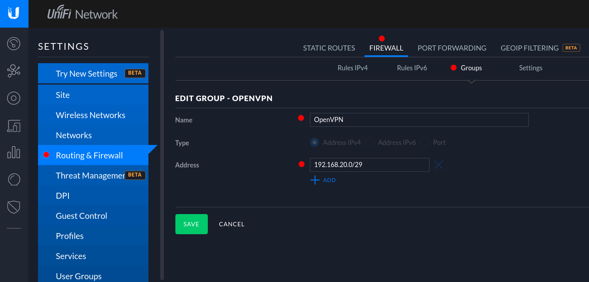
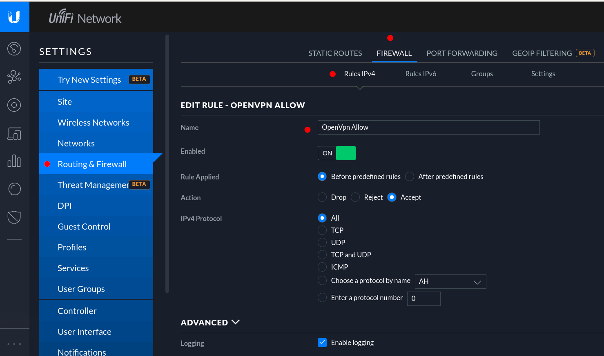
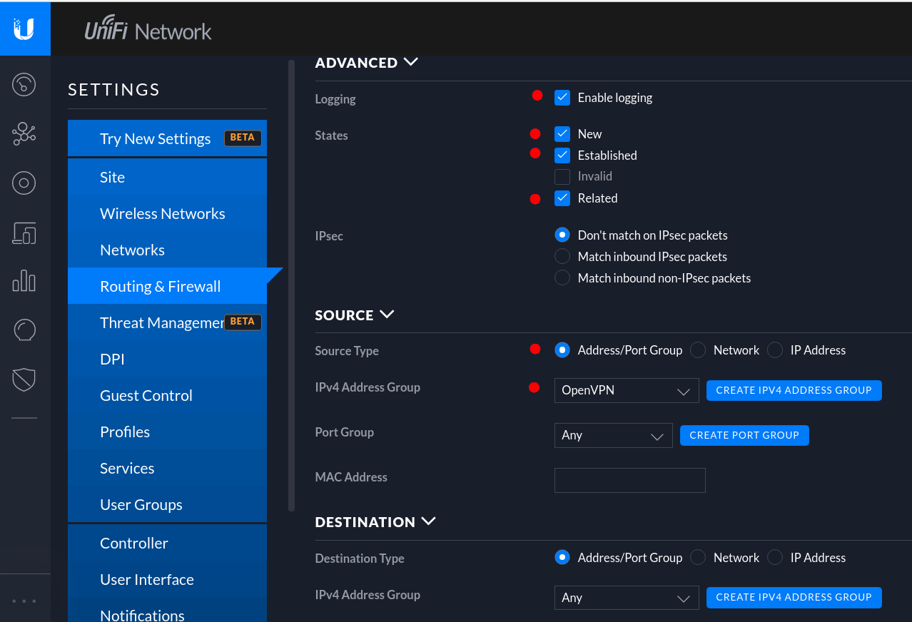
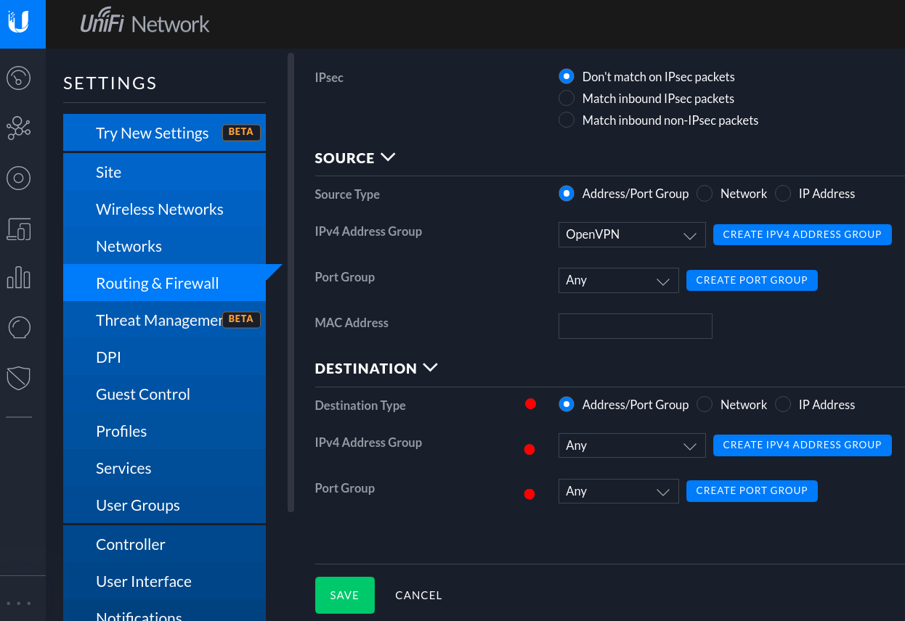
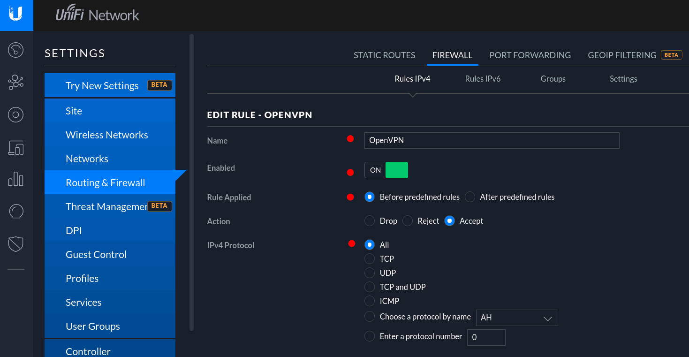
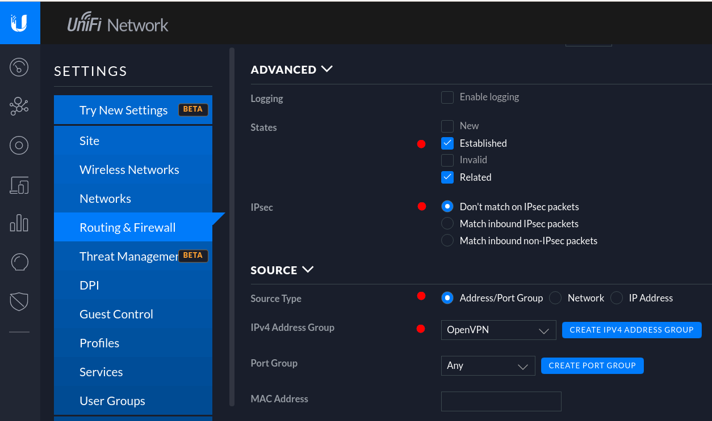
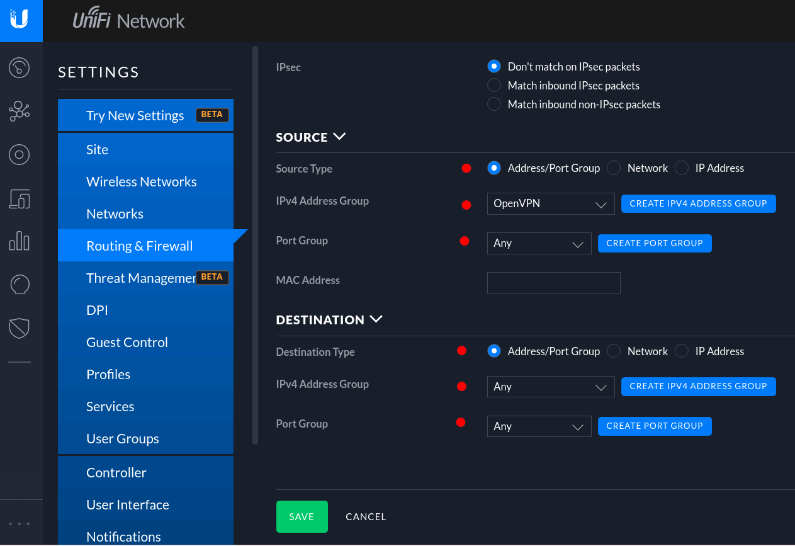

- [Tutorial: How to enable openvpn server in Unifi device?](#tutorial--how-to-enable-openvpn-server-in-unifi-device-)
  * [1 Enable SSH auth](#1-enable-ssh-auth)
  * [2 Security Gateway - Install easy-rsa](#2-security-gateway---install-easy-rsa)
  * [3 Security Gateway - Generate the client/server/ca keys](#3-security-gateway---generate-the-client-server-ca-keys)
    + [3.1 CA](#31-ca)
    + [3.2 Server](#32-server)
    + [3.3 Client](#33-client)
    + [3.4 Generate Diffie Hellman](#34-generate-diffie-hellman)
    + [3.5 Copy the keys](#35-copy-the-keys)
  * [4 Controller - Create config.gateway.json file](#4-controller---create-configgatewayjson-file)
  * [5 Firewall](#5-firewall)
  * [LAN IN](#lan-in)
  * [LAN OUT](#lan-out)
  * [6 Client](#6-client)
    + [Fedora 33](#fedora-33)
      - [Network Manager Settings](#network-manager-settings)
      - [Packages](#packages)
  * [Radius (Optional)](#radius--optional-)
  * [Useful links](#useful-links)

# Tutorial: How to enable openvpn server in Unifi device?
Steps how to configure openvpn in the Unifi

## 1 Enable SSH auth
1) Enable in the controlle SSH authentication via Advanced Features
    - Controller -> Settings -> Site -> DEVICE AUTHENTICATION  
      [**x**] Enable SSH Authentication


## 2 Security Gateway - Install easy-rsa
```
$ ssh admin@SECURITY_GATEWAY_IP
$ sudo su -
# curl -O http://ftp.us.debian.org/debian/pool/main/e/easy-rsa/easy-rsa_2.2.2-1_all.deb
# sudo dpkg -i easy-rsa_2.2.2-1_all.deb
```

## 3 Security Gateway - Generate the client/server/ca keys
### 3.1 CA
Common Name is "**OpenVPN CA**"
```
# cd /usr/share/easy-rsa
. vars
./clean-all
./build-ca
```

### 3.2 Server
Common Name is "**server**"
```
# ./build-key-server server
```

### 3.3 Client
```
# ./build-key client
```
### 3.4 Generate Diffie Hellman
```
# ./build-dh
```

### 3.5 Copy the keys
```
# mkdir /config/auth/keys/
# cp keys/* /config/auth/keys/
```

## 4 Controller - Create config.gateway.json file
```
$ ssh admin@CONTROLLER_IP
$ sudo su -
# cd /srv/unifi/data/sites/default  
# vi config.gateway.json
```
[See this working example of config.gateway.json](https://github.com/dougsland/unifi-openvpn/blob/main/CONTROLLER/srv/unifi/data/sites/default/config.gateway.json)

## 5 Firewall


## LAN IN




## LAN OUT




## 6 Client
### Fedora 33

```
$ cat /etc/fedora-release 
Fedora release 33 (Thirty Three)
```
#### Network Manager Settings


#### Packages
```
$ rpm -qa | grep NetworkManager
NetworkManager-l2tp-gnome-1.8.2-2.fc33.x86_64
NetworkManager-openvpn-gnome-1.8.12-1.fc33.1.x86_64
NetworkManager-ssh-1.2.11-2.fc33.x86_64
NetworkManager-vpnc-1.2.6-5.fc33.x86_64
NetworkManager-vpnc-gnome-1.2.6-5.fc33.x86_64
NetworkManager-ssh-gnome-1.2.11-2.fc33.x86_64
NetworkManager-openvpn-1.8.12-1.fc33.1.x86_64
NetworkManager-openconnect-gnome-1.2.6-5.fc33.x86_64
NetworkManager-strongswan-gnome-1.5.0-2.fc33.x86_64
NetworkManager-pptp-1.2.8-2.fc33.1.x86_64
NetworkManager-openconnect-1.2.6-5.fc33.x86_64
NetworkManager-l2tp-1.8.2-2.fc33.x86_64
NetworkManager-strongswan-1.5.0-2.fc33.x86_64
NetworkManager-pptp-gnome-1.2.8-2.fc33.1.x86_64
NetworkManager-libnm-1.26.4-1.fc33.x86_64
NetworkManager-1.26.4-1.fc33.x86_64
NetworkManager-wwan-1.26.4-1.fc33.x86_64
NetworkManager-bluetooth-1.26.4-1.fc33.x86_64
NetworkManager-adsl-1.26.4-1.fc33.x86_64
NetworkManager-ppp-1.26.4-1.fc33.x86_64
NetworkManager-team-1.26.4-1.fc33.x86_64
NetworkManager-wifi-1.26.4-1.fc33.x86_64
NetworkManager-config-connectivity-fedora-1.26.4-1.fc33.noarch
```

## Radius (Optional)

1) Enable Radius (Optional if you are using only auth keys)

   - Controller -> Settings -> Services -> Radius 

   - Server tab
     - Create secret
     - Authentication Port: 1812
     - AccountingPort: 1813
     - Account Interim Interval: 600
     - Tunnelled Reply: ON

   - Users tab
     - Name: YOUR_USERNAME
     - Password: YOUR_PASSWORD
     - Tunnel Type: 3- Layer Two Tunneling Protocol (L2TP)
     - Tunnel Medium Type: 1- IPv4 (IP version 4)


## Useful links
[UniFi - Accounts and Passwords for Controller, Cloud Key and Othe Devices](https://help.ui.com/hc/en-us/articles/204909374-UniFi-Accounts-and-Passwords-for-Controller-Cloud-Key-and-Other-Devices)  
https://blog.configwizard.xyz/configuring-openvpn-on-a-unifi-security-gateway/  
https://medium.com/server-guides/how-to-setup-an-openvpn-server-on-a-unifi-usg-e33ea2f6725d
